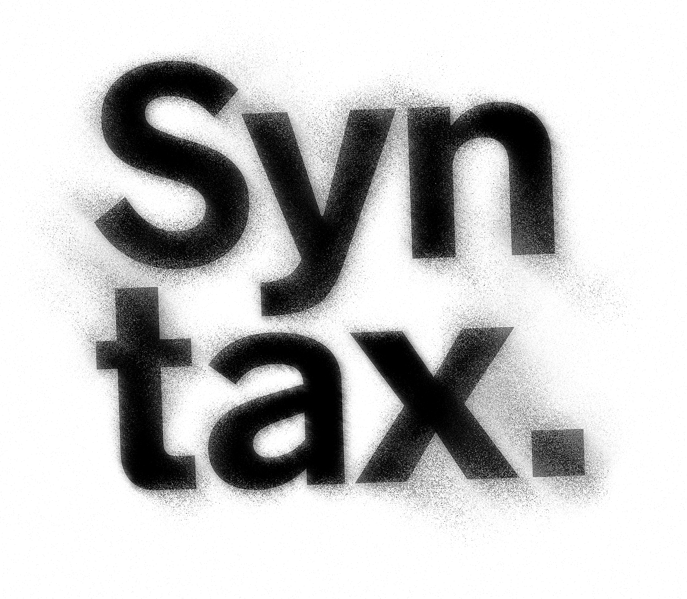

# Spray Anything

Programmatic spray paint effect. A reverse-engineered recreation of the [Texturelabs SprayAnything](https://texturelabs.org/tools/spray-anything-action/) Photoshop action — no Photoshop required.

Available in both **Python** (OpenCV/NumPy) and **JavaScript** (Node.js/sharp).




## What it does

Takes any image and makes it look spray-painted:

- **6-pass displacement mapping** using SprayMap.psd for organic paint warping
- **Clouds + Mezzotint** stochastic spray coverage texture
- **Noise → Threshold → Ripple** paint splatters at edges
- **Motion blur** with anti-aliased sub-pixel kernel (no diagonal banding)
- **Unsharp mask** for crisp particle edges

## Usage

### JavaScript (Node.js)

```bash
npm install
node spray_anything.js input.png output.png
node spray_anything.js input.png output.png --debug  # saves each step + filmstrip
```

### Python

```bash
pip install -r requirements.txt
python spray_anything.py input.png output.png
python spray_anything.py input.png output.png --debug
```

## `--debug` mode

Saves every intermediate step as a numbered PNG in `debug_steps/` and composites them into a 5×5 filmstrip grid next to the output file.

## How it works

1. **Ripple + Motion Blur** — initial organic distortion
2. **6× Displace** — SprayMap-driven pixel warping at scales 120–999, each pass faded
3. **70/30 blend** — mix displaced with original for subject clarity
4. **Coverage texture** — clouds + mezzotint + levels for spray density variation
5. **Edge speckles** — noise-threshold dots weighted by edge detection (Sobel)
6. **Paint grain** — mezzotint-style stochastic stipple
7. **Sharpen** — Gaussian blur 0.4px → unsharp mask 100%/2px

## Files

- `spray_anything.js` — JavaScript version (sharp + raw typed arrays)
- `spray_anything.py` — Python version (OpenCV + NumPy)
- `SprayMap_composite.png` — displacement map extracted from the original Texturelabs SprayMap.psd
- `example/syntax-logo.png` — sample input image for testing

## License

MIT
